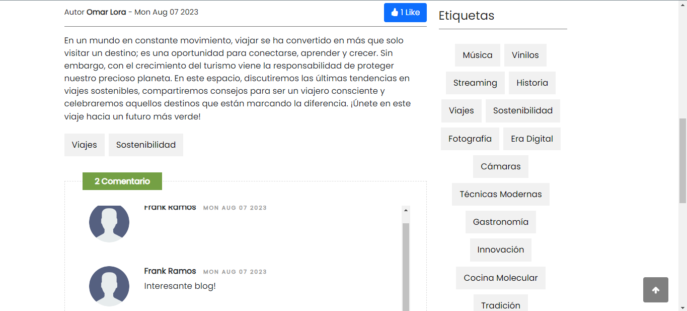

# Requerimientos

## Tecnologías a Utilizar
Independientemente del tema escogido para el proyecto final se espera que se utilice javascript (ES6), el framework React y Firebase como tecnología para el backend.

## Opción 1 (Muro Interactivo)
Haga un sistema WEB que permita a los visitantes las siguientes funcionalidades:
1. Ver todas las publicaciones hechas por todos los usuarios (No requiere autenticación)
2. Crear una cuenta de usuario (del usuario se guardará: usuario, clave nombre, apellido)
3. Iniciar Sesión
4. Publicar nuevos posts (Solo usuarios autenticados)

## Solución

### 1. Ver todas las publicaciones hechas por todos los usuarios (No requiere autenticación)

### 2. Crear una cuenta de usuario (del usuario se guardará: usuario, clave nombre, apellido)

### 3. Iniciar Sesión

### 4. Publicar nuevos posts (Solo usuarios autenticados)

### En este caso se puede ver que el usuario que publicó el post es el mismo que está logueado en el sistema y puede ver el botón de eliminar y editar el post.

### En este caso se puede ver el boton de like y se puede comentar el post.

## Este fue el resultado final del proyecto realizado por Frank Ramos de la asignatura de Programación Web.